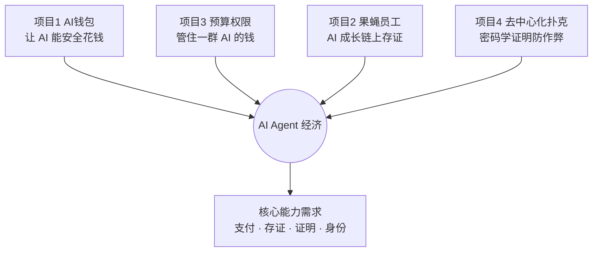

# 路演夜精读：四个 AI × Web3 项目

> 来源：《AI 与 Web3 三项目路演进展与需求》现场录音（约 37 分钟）
> 形式：四位 Builder 依次上台 Demo 自己的项目，最后留微信招人 / 找合作。

## 这场活动一句话总结

四个项目都指向同一个大趋势：**让 AI Agent（能自己干活的 AI）学会「安全地花钱」，并把它的行为记录在区块链上**。

- 项目 1 给 AI 一个「零花钱钱包」；
- 项目 2 让 AI（一只数字果蝇）在浏览器里养成，成长记录上链；
- 项目 3 给一群 AI 立「预算和权限规矩」；
- 项目 4 用密码学证明做一个「官方绝对没法作弊」的在线扑克。

即使技术细节你现在看不懂也没关系，**先记住这四个项目分别解决什么问题**，技术名词以后会一个个学。

---

## 项目一：Monet Switch —— 给 AI 的「零花钱钱包」

**主讲人：郭春丽**（独立开发者，自称做过约 200 个 AI 项目，曾做出抖音爆款「龙虾糖」）

### 它解决什么痛点

现在的 AI Agent 越来越能干，但有一个尴尬：**它没法自己付钱**。

举个例子：你让 AI 帮你调用一个付费 API（比如某个数据接口，调一次收几分钱），AI 干到一半发现要付费，只能停下来问你要银行卡号。而把银行卡直接交给 AI 又很危险——它可能乱花、被骗、把凭证泄露出去。

### 它怎么做

做一个**给 AI 用的钱包**，核心思路用主讲人的话说就是：

> **「给 AI 零花钱，银行卡留在你手里。」**

- 你往这个 AI 钱包里充一小笔钱（「零花钱」），AI 只能花这笔钱；
- AI 要花钱 / 收钱时，通过一个叫 **MCP【概念】** 的服务来完成（MCP 可以理解为「AI 调用外部工具的标准插座」，就像 USB 接口，插上就能用各种服务）；
- 即使钱包被盗（「被突」），单笔上限几千笔也不会造成大额损失，而且**一键撤销、立刻生效**；
- 主讲人展示了在 Monad 测试网【概念】上的成果：11 笔真实结算、92 个测试全部通过（「全绿」）。

主讲人还用 AI 视频工具（提到 OPPO / 某模型 5.5）几分钟生成了一条广告片，台词是：

> 「给每个员工的每个 Agent 发一把钥匙，员工一条命令就……」「给 AI 零花钱，银行卡留在你手里，Monet Switch。」

### 小白能学到什么

1. **MCP 是 2024-2025 年 AI 圈最重要的概念之一**：它让 AI 能标准化地连接外部工具（包括支付）。记住「MCP = AI 的工具插座」。
2. **AI 支付是一个真实的新赛道**：当 AI 从「聊天工具」变成「执行工具」，「谁来替它管钱、怎么保证安全」就成了刚需。
3. **独立开发者也能跑通全流程**：一个人 + AI 编程工具，就能做出钱包、上链、甚至广告片。
4. 主讲人反复说「我现在还是一个人，需要运营」——**技术人常常缺会讲故事、会做社区的搭档**，这其实是文科 / 语言背景学生的机会。

### 延伸概念

`AI Agent`、`MCP（Model Context Protocol）`、`测试网 Testnet`、`结算 Settlement`、`私钥/钥匙`、`开源`

---

## 项目二：浏览器里的「果蝇数字员工」

**主讲人：未署名（项目基于谷歌开源的果蝇大脑模型）**

> 这是四个项目里最「科幻」的一个，别急，慢慢看。

### 它解决什么痛点

现在大多数 AI Agent 有两个问题（主讲人的观点）：

1. **大家共享同一套服务器和同一个「大脑策略」**：结果千千万万个 AI 决策方式雷同，像同一个「黑箱」；
2. **成长过程无法追溯**：一个 AI 为什么变聪明了、经历了什么训练，没有可信记录。

### 它怎么做

不做大语言模型（ChatGPT 那种），而是**在你自己的浏览器里，完整模拟一只「果蝇的大脑」**，养成一只属于你的数字员工。

**为什么是果蝇？** 果蝇的大脑相对简单且已被科学家完整测绘：

- 约 **16 万个神经元**；
- **2500 多万条有效连接**；
- 其中 **7835 个「可塑连接」**（可以理解为「能被训练改变的连接」）。

这套神经模型完全在浏览器本地用 **WASM【概念】** 运行（WASM = 让网页高速运行程序的技术），大脑数据**不离开你的电脑**。

**养成五步：领养 → 养成 → 冻结 → 比较 → 协作**

| 步骤 | 做什么 |
|---|---|
| 领养 | 在本地生成你自己的「所有者密钥」和果蝇的身份 |
| 养成 | 浏览器里运行推理（思考）和「可塑性分析」（学习） |
| 冻结 | 在「考试」（用没见过的新数据测试）前，冻结学习记录，把记录的「哈希指纹」**上链** |
| 比较 | 不同果蝇可以横向比较成绩 |
| 协作 | 多只果蝇组成「群落」一起决策（比如投票），**但不会合并彼此的大脑** |

**链上只存「指纹」，大脑留在本地**：

- 第一步：导出神经元状态，计算存档包，把清单哈希上链；
- 第二步：在 Monad 测试网把钱包记录上链，合约登记来源；
- 第三步：校验与恢复——读链上记录，对比本地存档，哈希一致才算没被篡改。

**演示场景**：训练一只做「股票模拟交易」的果蝇——做对了就模拟分泌「多巴胺」（奖励），做错了就刺激「痛觉神经」（惩罚）。多只果蝇投票，结果大部分选择「观望」，达到门槛后就执行多数派的选择。

### 为什么不用 ChatGPT 那种大模型？（主讲人的核心论点）

- **果蝇模型**：基于「连接组」的脉冲神经网络，神经状态会持续演化，模拟的是真正的「学习机制」；
- **大语言模型 LLM**：本质是「根据上文猜下一个词」，靠提示词和微调整合记忆，主讲人认为那不是真正的神经状态实验机制。

> 注意：这是该项目的一家之言，不代表 LLM 没有价值。重点是理解「**不同的 AI 范式**」这个概念。

### 小白能学到什么

1. **「本地运行 + 链上存证」是 AI × Web3 的经典组合**：隐私数据留在本地，链上只放无法伪造的「指纹」（哈希），既保护隐私又可验证。
2. **哈希（Hash）= 数字指纹**：文件哪怕改一个字，哈希就完全不同。这是区块链「防篡改」的基础，务必搞懂。
3. **脉冲神经网络（SNN）、连接组（Connectome）** 是 AI 的另一条路线，不必现在懂，知道存在即可。
4. **DAO / 群体决策**的雏形：多只果蝇投票做决定，这和 Web3 的 DAO【概念】治理思路一致。
5. 主讲人提到赛道是 Monad 的「**去中心化身份（DID）与 AI 构造器**」，还提到某个标准（音似 ERC-800）「尚未实现」——*待核实*。

### 延伸概念

`WASM`、`哈希 Hash`、`智能合约`、`DID 去中心化身份`、`SNN 脉冲神经网络`、`连接组`、`DAO`、`测试网`

---

## 项目三：Text Permit —— 给一群 AI 立「预算和权限规矩」

**主讲人：何佳，华南理工大学软件学院**

> 这是四个项目里逻辑最清晰、对小白最友好的一个，建议精读。

### 它解决什么痛点

设想一个场景：一个团队同时用 3 个 AI Agent 做市场调研——

- Agent 1：负责上网搜资料；
- Agent 2：负责买调研数据（比如财务年报）；
- Agent 3：负责整理报告。

团队只想为这件事花 **10 美元**。但问题是：**3 个 Agent 各自调用不同的付费工具，谁也不知道整体花了多少**。在系统后台看到的是一笔笔分散的请求，等加起来发现：超支了。

- Agent 1 花 6 美元；Agent 2 又申请 5 美元；Agent 3 再花 1 美元——总共 12 美元，超了。
- 每个 Agent 都觉得「我没超我的那份」，但**全局预算已经爆了**。

### 它怎么做：三件套

1. **共同额度（共同钱包）**：面向「这一项任务」设一个总预算，所有 Agent 都从这一个池子里拿钱；
2. **权限卡**：写清楚每个 Agent 能用哪些工具、做哪些任务、能花多少钱、什么时候失效；
3. **可核对的账本**：谁批准、谁调用、实际花了多少，全部记录；超额可以回溯、事后追责（「反补」）。

### 资金流转流程（重点理解这个机制）

1. 负责人定义任务，写入预算和权限；
2. Agent 请求进来，系统**先检查两件事**：有没有权限？任务还剩多少钱？
3. 核查通过后，**先「占住」额度（预授权）**，再去调用付费工具；
4. 工具返回后，按**实际费用**结算，把多占的钱**释放**回去；
5. 如果结果没回来，额度先保留，**避免同一笔钱花两次**。

**用数字走一遍：**

- 总预算 10 美元；Agent A 申请 6 美元 → 系统预留 6 美元，剩 4 美元；
- Agent B 申请 5 美元 → 虽然它有权限，但**只剩 4 美元，系统直接拒绝**，请求根本不会进入付费工具；
- A 实际只花了 4.2 美元 → 系统按 4.2 结算，释放多占的 1.8 美元，可用回到 5.8 美元；
- 网络原因导致回执重复到达 → 系统认出是同一笔，**不重复扣款**；
- 负责人**撤销任务**后，即使账户里还有余额，新请求也不能再执行——「有余额」和「有权限」被彻底分开。

### 最重要的设计原则

> **「不能让 Agent 自己承诺会遵守预算。」**

预算检查、金额分析、权限判断、执行状态，全部由**独立的程序**完成，而不是交给 Agent 自觉。否则 Agent 等于拿到了「万能钥匙」，可能「聪明地」绕过系统。这和现实公司里「管钱的和花钱的必须是不同的人」是一个道理。

**防篡改演示**：系统生成一条回执并签名；把金额从 4.2 改成 9 再核验，立刻失败——说明记录一旦被改就能被发现。

### 系统定位

它**不替代**现有的 Agent 框架、钱包、支付协议，而是夹在中间的「中间件（Middleware）」：

- 身份工具解决「谁在操作」；
- 支付协议解决「怎么付款」；
- 日志系统解决「发生了什么」；
- Text Permit 补上最容易缺失的一层：**共同预算 + 执行边界**。

### 落地计划

- 第 1 个 30 天：打通授权、预算、结算、撤销；
- 再加入支付适配、故障恢复；
- 最后邀请 3-5 个真实团队用真实任务验证，验收标准包括：超额被拒绝、重复请求不重复扣款、撤销后异常恢复。

### 小白能学到什么

1. **预授权 - 结算 - 释放**是真实支付系统（包括信用卡、酒店押金）的通用模式，非常值得理解。
2. **「不能让执行者自己当裁判」是重要的系统设计思想**，在金融风控、智能合约设计里反复出现。
3. 这个项目本身就是一个极好的「**产品思维范本**」：从一个具体痛点出发，机制严密，可验证。
4. 结尾金句适合记下来：

   > 「AI Agent 正从回答问题走向替人执行。执行能力越强，预算和权限边界就越需要被记录下来。给 Agent 执行的能力，让团队守住可掌握的边界。」

### 延伸概念

`中间件 Middleware`、`预授权/预占额度`、`数字签名`、`幂等性（重复请求只生效一次）`、`对账`

---

## 项目四：完全去中心化的在线扑克协议

**主讲人：未署名（近 10 年工作经验，游戏开发背景，曾在年营收约 4 亿港币的游戏公司任职）**

### 它解决什么痛点

在线扑克 / 棋牌最大的信任问题是：**玩家怎么知道官方没作弊、没提前看到牌？**

主讲人指控：行业里做得最大的平台（音似 ClubGG / 某国际扑克平台）虽然标榜「结果可验证」，但**本质仍是中心化的**——在牌发出来之前，后台理论上已经能算出所有牌面。

### 它怎么做：三大支柱

1. **完全去中心化，没有「需要信任的对象」**：
   - 客户端在浏览器里就能验证一切：洗牌过程、每一步操作、牌局结果；
2. **全面采用最新的「证明」技术栈**（音似 STW / STWO，属于零知识证明 ZK【概念】类技术，2024 年公布、2026 年有版本更新）：
   - 游戏里每一个步骤都能被「证明」，运营方**没有作弊的可能**；
   - 之所以不用更早的证明系统，是因为它们太慢、需要很强的硬件，证明成本高到收入都覆盖不了；
3. **自研安全（自研专用链 AppChain【概念】）**：
   - 现有链即便是号称高并发的，最终确认也可能要 4 秒，满足不了扑克的实时性；
   - 主讲人认为要做到「Web2 级体验」必须自己做一条专用链，并以 **Hyperliquid**（一个非常成功的去中心化衍生品交易专用链）为标杆。

### 一个协议层创新：玩家掉线怎么办

传统平台的做法很粗暴：玩家掉线就「罚款」。但这对玩家不公平——违法（掉线）成本很低时，玩家干脆弃牌走人。

主讲人自称首创了一套协议：**在完全去中心化的牌局里，即使玩家掉线，游戏也能继续进行**，从协议层面（而不是罚款）保护公平。

### 核心观点

> **「安全是解决用户摩擦成本最好的体验。」**

- 上链 / 外部操作的成本对普通用户仍然太高；
- 首屏卡顿、延迟会直接降低转化率；钱包的买入、交付环节直接影响留存；
- 只有把体验做到极致、门槛足够低，「完全去中心化」才有底气去和中心化巨头竞争。

主讲人最后坦承：技术已经领先，但**最缺两样东西——运营（把故事讲好、做好用户界面和社区）和投资人的建议**。他也感慨今年赛道热点全是 AI 和某个方向，纯游戏的故事不好讲；尝试过「AI 扑克 / AI 分析」，但用户不太愿意为此付费。

### 小白能学到什么

1. **零知识证明（ZK Proof）**：让你「不透露秘密，也能向别人证明某件事是真的」（比如证明我没作弊，但不亮出我的牌）。这是 Web3 最硬核也最有前景的方向之一。
2. **AppChain（应用专用链）**：当一条通用链满足不了某个应用的性能，就为这个应用单独做一条链。Hyperliquid 是最成功的案例，值得记住。
3. **「去中心化」不是喊口号**：关键在于客户端能否独立验证、是否存在中心化的幕后控制点。
4. 再次印证：**强技术团队普遍缺运营 / 内容 / 社区角色**——这是非技术背景同学切入 Web3 项目最现实的入口。
5. 也给我们泼了一盆冷水：**好技术 ≠ 好生意**，用户是否愿意付费、体验是否够好同样关键。

### 延伸概念

`零知识证明 ZK`、`AppChain 应用链`、`去中心化`、`客户端验证`、`Hyperliquid`、`TPS / 最终确认时间`

---

## 这场路演的共同主线（串起来理解）

四个项目共同透露的信号：

1. **AI Agent 正在从「聊天」走向「执行」，而执行就绕不开「钱」和「信任」**；
2. **Web3（区块链）恰好提供了「不依赖单一中心方」的支付、存证、证明工具**——AI × Web3 的结合点就在这里；
3. 行业真实的人才缺口，除了工程师，还有**运营、内容、社区、产品、合规**；
4. 大量项目跑在 **Monad** 这类新一代高性能 EVM 链上（下一场活动的主角）。

## 我现在能做什么（大一版清单）

- [ ] 用自己的话，向朋友 / 在笔记里复述这四个项目分别解决什么问题；
- [ ] 查清楚并记下这几个词的「人话解释」：**MCP、AI Agent、智能合约、测试网、哈希、零知识证明**（可参考 [小白词典](../02-glossary/01-beginner-dictionary.md)）；
- [ ] 注册一个 MetaMask 钱包（先只玩测试网，**绝不充钱**），体验一次「钱包」是什么；
- [ ] 了解 MCP：找一篇 MCP 科普文章读一读，知道它长什么样；
- [ ] 把这四位主讲人「缺运营 / 缺搭档」的信号记在心里——**这就是我未来可以提供价值的位置**；
- [ ] 去读第二篇精读：[Monad 黑客松与 Agent 金融圆桌](./02-monad-hackathon.md)，搞懂大家反复提到的 Monad 到底是什么。

> 下一篇 → [Monad 黑客松宣讲与 Agent 金融圆桌精读](./02-monad-hackathon.md)
