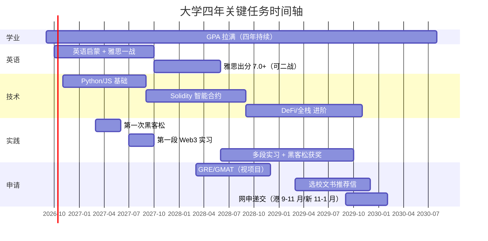

# 四年总路线图：广外大一 → 港 / 新 Web3 硕士

> 时间锚点：2026 年 9 月入学，正常 2030 年 6 月本科毕业、2030 年秋硕士入学。
> 申请季 = **2029 年 9 月 ~ 2030 年初**。

## 全局一张图

## 录取委员会到底看什么（先搞懂游戏规则）

港 / 新授课型硕士的录取，按权重粗略排序：

1. **本科院校 + GPA**（门槛项，双非靠高 GPA 补）；
2. **语言成绩**（雅思 / 托福，硬门槛）；
3. **相关软背景**：实习、项目、竞赛（黑客松）、科研 / 论文、交换；
4. **文书（PS）+ 推荐信 + 面试**：讲一个「你为什么、凭什么读这个方向」的可信故事；
5. **GRE / GMAT**：部分项目建议 / 要求（如 NUS DFinTech 建议 GRE 320 / GMAT 700）。

> 对双非学生最现实的策略：**用「专业前 5% 的 GPA + 7.0+ 雅思 + 3 段 Web3 相关实践 + 公开作品集」去对冲院校背景**。本文档所有安排都围绕这个公式。

---

## 大一（2026.9 – 2027.6）：打地基 + 建习惯

> 关键词：**GPA、英语启蒙、概念入门、Wiki 上线、混圈子**

### 学业（最高优先级）

- [ ] 从第一门课开始冲 GPA，目标 **GPA 3.7+/4.0、专业前 10%（最好前 5%）**；
- [ ] 重点学好：高数 / 微积分、线代、概率论、英语、任何编程 / 计算机导论课；
- [ ] 主动认识任课老师，为以后推荐信、科研打基础。

### 英语（发挥广外优势）

- [ ] 把英语当日常：每天读英文 Web3 / AI 资讯（见资源清单）；
- [ ] 了解雅思题型，背单词、练听力口语；
- [ ] 大一暑假前可做一次雅思模考 / 一战摸底（目标 6.5 起步）。

### 技术启蒙（不追求快，追求不害怕）

- [ ] 搞懂电脑基础：命令行、Git / GitHub、Markdown（跟着 [GitHub 指南](../05-playbooks/02-github-and-personal-ip.md) 走）；
- [ ] 入门一门语言：**Python**（对小白最友好），完成基础语法；
- [ ] Web3 体感：装 MetaMask、领测试币、在测试网转一笔账（**不花真钱**）；
- [ ] 体验 MCP、X402 相关 Demo，知道 Agent 怎么调工具 / 付费。

### 实践与输出

- [ ] **把这个 Wiki 推上 GitHub**，持续更新；
- [ ] 每参加一场活动 / 读懂一个主题，就写一篇公开笔记；
- [ ] 加入 3-5 个高质量社群（项目 Discord、开发者社区），先潜水观察、适时提问；
- [ ] 关注 Monad、ETH Global 等黑客松信息，**这届来不及就先看懂规则**；
- [ ] 留意学校的海外交换 / 暑校 / 2+2 项目（尤其港新合作）。

### 大一暑假（2027.7-8）

- [ ] 系统学 JavaScript 基础；
- [ ] 尝试一个最小项目（如用 Python 调一个公开 API 做小工具）；
- [ ] 参加线上 / 线下 Web3 活动，开始线下见同行。

---

## 大二（2027.9 – 2028.6）：出成果 + 第一次实战

> 关键词：**雅思出分、Solidity 入门、第一次黑客松、第一段实习**

### 学业 & 英语

- [ ] 保持 GPA 不掉；
- [ ] **雅思正式出分：总分 7.0、小分 6.0+**（港新主流项目够用，冲港三建议 7.0+）；
- [ ] 若成绩不理想，本学期内二战搞定，别拖到大三。

### 技术

- [ ] JavaScript / TypeScript + Node.js 基础；
- [ ] **入门 Solidity 与智能合约**（CryptoZombies、官方文档、Cyfrin Updraft）；
- [ ] 学会 Hardhat 或 Foundry 开发框架，在测试网部署第一个合约；
- [ ] 理解 DeFi 核心：代币、DEX、借贷、稳定币、预言机（结合 [小白词典](../02-glossary/01-beginner-dictionary.md)）。

### 实践（里程碑）

- [ ] **组队参加一次黑客松**（Monad / ETH Global / 港新本地赛），目标是完整提交、不强求获奖；
- [ ] 做 1-2 个能写进简历的 GitHub 项目（前端 + 合约的完整小应用）；
- [ ] **争取第一段 Web3 相关实习**：可从运营、内容、社区、增长、DevRel 助理切入（参考 [实习指南](../05-playbooks/03-internship-job-guide.md)），远程也可；
- [ ] 争取一次港 / 新暑校或交换（拿推荐信、体验目标地）。

### 输出

- [ ] Wiki 增加「实战复盘」栏目：黑客松、项目、实习复盘；
- [ ] 开始经营 X（Twitter）等公开账号，持续发学习 / 项目内容。

---

## 大三（2028.9 – 2029.6）：攒硬货 + 定方向

> 关键词：**高质量实习、黑客松获奖、科研 / 论文、推荐信、GRE**

### 学业 & 标化

- [ ] GPA 稳住（大三成绩仍计入，且申请时是最新的重要参考）；
- [ ] 视目标项目准备 **GRE（目标 320+）/ GMAT（700+）**，大三上 ~ 暑假搞定；
- [ ] 雅思若将过期（成绩 2 年有效），安排重考。

### 技术进阶

- [ ] Solidity 进阶 + 安全（测试、模糊测试、常见漏洞、审计基础）；
- [ ] 完整全栈能力：React / Next.js + 合约 + 索引（The Graph 等）；
- [ ] 选一个细分方向深入：**Agent 支付 / DeFi / DID / RWA / ZK**，形成自己的「主张」。

### 实践（含金量最高的一年）

- [ ] **2 段以上高质量 Web3 实习**（优先香港 / 新加坡 / 知名项目 / 有留用或强推荐信）；
- [ ] 再打 2-3 次黑客松，**争取进入决赛 / 获奖**；
- [ ] 参与开源项目（给真实项目提交 PR）；
- [ ] **科研 / 论文**：跟教授做区块链 / AI 金融相关课题，争取工作坊 / 期刊产出；
- [ ] 锁定 2-3 位推荐人（专业课教授 + 科研导师 + 实习上司）。

### 输出 / IP

- [ ] 个人 IP 成型：稳定的技术博客 / Wiki + X 粉丝 + 可展示项目集；
- [ ] 整理一份「个人作品集网站」（Wiki 部署到 GitHub Pages 即可）。

---

## 大四（2029.9 – 2030.6）：申请季 + 收尾

> 关键词：**文书、网申、面试、毕设、Offer**

### 申请时间轴（严格卡节点）

- [ ] **2029 年 3-8 月**：最终选校（冲刺 / 主申 / 保底分层）、考齐标化、敲定推荐人；
- [ ] **6-9 月**：写 PS / CV，准备推荐信，整理作品集；
- [ ] **香港**：多数项目 9-11 月陆续开放、**滚动录取（Rolling），越早递交越有利**，第一轮多在 10-11 月；
- [ ] **新加坡**：NUS DFinTech 约 **11 月开放、1 月底截止（仅一轮）**，务必卡 deadline；NTU / SMU 按官网；
- [ ] **2029 年底 – 2030 年初**：递交、跟进、准备面试（模拟面试 + 英文表达）；
- [ ] **2030 年 1-5 月**：收 Offer、比较、缴留位费、办签证 / 住宿。

### 学业收尾

- [ ] 毕业设计尽量结合 Web3 / AI（可延续自己的项目，一举两得）；
- [ ] 保持最后一年 GPA，避免条件录取翻车。

---

## 每学期通用节奏（建议收藏）

| 时间 | 固定动作 |
|---|---|
| 每天 | 30 分钟英文资讯 + 代码 / 工具练习 |
| 每周 | 1 篇学习笔记或项目进度（提交到 Wiki） |
| 每月 | 复盘 GPA / 目标进度，更新路线图 |
| 每学期 | 1 个可展示成果（项目 / 比赛 / 实习 / 科研） |
| 每个暑假 | 实习 / 暑校 / 高强度项目（暑假是拉开差距的关键） |

## 风险提示与备选

- **若 GPA 不理想**：港三新二难度大，重心转向城大 / 理大 / SMU 等更友好项目，并延长软背景积累；Gap 一年做高质量实习也是可选项；
- **若技术学得吃力**：可走 Web3 的非技术赛道（运营 / 市场 / 合规 / 投研 / DevRel），同样能入行，且更贴合语言优势；
- **行业周期风险**：Web3 牛熊波动大，「建铁路」型能力（工程、合规、金融）跨周期更稳；
- **政策风险**：关注香港 SFC、新加坡 MAS 的监管动向，优先选择合规生态。

## 下一步

- 查 [港新 Web3 硕士项目清单](./02-hk-sg-masters.md)，建立具体目标；
- 按 [技能树与免费资源](../04-skills/01-skill-tree-resources.md) 开始大一学习；
- 立刻动手 [把 Wiki 推上 GitHub](../05-playbooks/02-github-and-personal-ip.md)。
