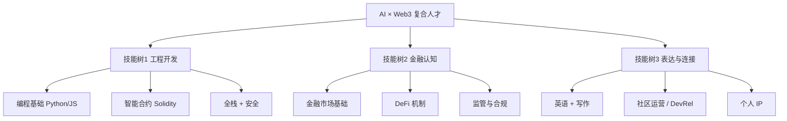

# 技能树与免费学习资源

> 一份「不花大钱也能学到能找实习」的资源清单。资源名称都可直接搜索到官网；链接以官方为准。

## 一、三条技能树总览

- 走**技术路线**：重点攻技能树 1，技能树 2 做业务理解；
- 走**非技术路线**（运营 / 市场 / 投研 / 合规 / DevRel）：重点攻技能树 2、3，技能树 1 学到「能看懂、能对话」。

## 二、分阶段学习路径（对应四年）

| 阶段 | 工程主线 | 配套产出 |
|---|---|---|
| 大一上 | 计算机导论 + Git/Markdown + Python 语法 | Wiki 上线、概念笔记 |
| 大一下 ~ 暑假 | JavaScript + 第一个 API 小工具 | 1 个非链小项目 |
| 大二上 | Solidity 入门 + Remix/Foundry | 测试网部署第一个合约 |
| 大二下 ~ 暑假 | 全栈 dApp + 第一次黑客松 + 实习 | 1 个完整 dApp |
| 大三 | DeFi 进阶 + 合约安全 + 细分方向 | 黑客松获奖、2 段实习、科研 |
| 大四 | 毕设 + 申请 | 作品集 + Offer |

---

## 三、免费课程清单

### A. 计算机与编程基础

| 资源 | 学什么 | 说明 |
|---|---|---|
| **CS50**（哈佛，edX/YouTube） | 计算机科学导论 | 小白建立「计算机世界观」首选，有中文字幕 |
| **freeCodeCamp**（官网/YouTube） | Python、JS、Web、数据 | 完全免费、项目驱动、有认证 |
| **The Odin Project** | 全栈 Web 开发 | 想做前端 / 全栈的系统路径 |
| 菜鸟教程 / MDN Web Docs | 语法查询 | 当字典查 |

### B. 区块链与智能合约（核心）

| 资源 | 学什么 | 说明 |
|---|---|---|
| **CryptoZombies** | Solidity 游戏化入门 | 边玩边学，零基础友好 |
| **Cyfrin Updraft** | 区块链 + Solidity 全流程 | 免费、行业最主流推荐路径之一（Patrick Collins），搜索结果多次列为 2026 默认方案 |
| **Solidity by Example** | 合约范例 | 用例子学，适合查写法 |
| **Foundry Book**（官方文档） | Foundry 开发框架 | 主流合约开发 / 测试框架，必读 |
| **Remix IDE**（网页版） | 在线写合约 | 不用配环境，第一份合约在这里写 |
| **Alchemy University** | Web3 开发 | 免费、项目制 |
| **Scaffold-ETH 2** | dApp 脚手架 | 一键起项目，黑客松利器 |
| ethereum.org 官方文档 | 以太坊基础 | 权威入门 |

### C. 合约安全（进阶，大三重点）

| 资源 | 学什么 |
|---|---|
| **Ethernaut**（OpenZeppelin） | 合约漏洞闯关，在实战中学安全 |
| **Capture the Ether** | 安全挑战 |
| OpenZeppelin Contracts 文档 | 标准安全组件库 |
| Solidity 安全考量（官方 docs） | 常见漏洞清单 |
| DeFi 攻击复盘（rekt.news 等） | 真实爆雷案例 |

### D. AI / Agent

| 资源 | 学什么 |
|---|---|
| **李宏毅机器学习 / 生成式 AI**（台大，YouTube，中文） | ML / LLM / Agent 中文最佳入门 |
| **DeepLearning.AI**（吴恩达，部分免费） | AI、Agent 应用开发短课 |
| **MCP 官方文档**（modelcontextprotocol.io） | MCP 协议与开发 |
| OpenAI / Anthropic 官方文档 | Agent、工具调用、SDK |
| X402 相关文档（Coinbase 等） | Agent 支付协议 |

### E. 金融与 DeFi

| 资源 | 学什么 |
|---|---|
| **Investopedia** | 金融术语百科（英文，查概念） |
| **Finematics**（YouTube） | DeFi 机制动画科普 |
| **Whiteboard Crypto** | 加密 / 区块链科普 |
| Uniswap / Aave / Compound 官方文档 | 头部 DeFi 协议怎么运作 |
| Coursera 金融 / 经济学入门课 | 金融市场基础 |
| 可汗学院（Khan Academy） | 经济金融零基础 |

---

## 四、日常信息源（培养「行业体感」）

### 英文（一手信息，必跟）

- **X / Twitter**：关注 项目官方、创始人、开发者、VC（自己慢慢建 list）；
- **Newsletter**：Week in Ethereum News、Bankless、Mirror 上的优质长文；
- **YouTube**：Patrick Collins、Smart Contract Programmer、Finematics；
- **数据 / 浏览器**：Etherscan、Dune Analytics（链上数据分析）、DeFiLlama（TVL 数据）。

### 中文（辅助理解）

- 律动 BlockBeats、PANews 等行业媒体；
- 优质公众号 / 知识星球（注意甄别，别被「带单 / 暴富」内容带偏）；
- B 站的搬运 / 教程（注意时效）。

> 提醒：**AI 本身就是最好的「私教」**。读不懂的英文、搞不懂的概念，让 AI 逐段给你讲、让它出题考你；但涉及事实和数据要核实，警惕幻觉。

---

## 五、必备工具（先装起来）

| 工具 | 用途 |
|---|---|
| **VS Code** | 写代码 / 笔记的编辑器 |
| **Git + GitHub** | 版本管理、作品集（见 [GitHub 指南](../05-playbooks/02-github-and-personal-ip.md)） |
| **MetaMask / Rabby** | Web3 钱包（先只连测试网） |
| **Python / Node.js** | 运行环境 |
| **Foundry / Hardhat** | 合约开发框架 |
| **Discord** | 项目社区、组队 |
| **Notion / Obsidian / 本 Wiki** | 知识管理（本 Wiki 用 Markdown，可被 Obsidian 直接打开） |
| 1Password 等 | 密码管理（私钥 / 助记词离线保管，绝不存云端明文） |

## 六、实践平台（学完就去练）

- **黑客松**：Monad、ETH Global、Devfolio / Dorahacks 上的各类赛事（见 [黑客松指南](../05-playbooks/01-hackathon-guide.md)）；
- **测试网**：各公链测试网 + 水龙头（Faucet）领免费测试币；
- **开源贡献**：在 GitHub 给真实项目提 issue / PR；
- **链上数据分析**：Dune、Flipside Crypto（有赏金任务，适合练 SQL + 拿作品）。

---

## 七、学习防坑提醒

1. **别做「收藏家」**：囤 100 个链接不如跟完 1 门课、做出 1 个东西；
2. **别等「完全学懂」才动手**：项目驱动，边做边补；
3. **别花钱买「暴富 / 带单 / 内部资源」**：真正的好基建大多免费开源；
4. **别用真金白银练手**：测试网、模拟盘先行；
5. **别孤军奋战**：进社区、找队友、多提问、多线下见人。

## 我的学习打卡（建议复制使用）

- 本周主线课程：____
- 本周产出（笔记 / 代码链接）：____
- 遇到的问题 & 如何解决：____
- 下周计划：____

> 下一步 → [英语标化与背景提升](./02-english-and-profile.md)
