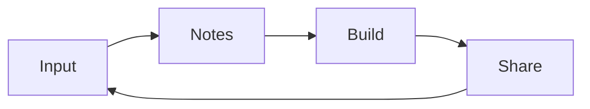

# How to Use This Wiki

## The loop

The whole knowledge base is organised around one loop:

- **Input**: industry events, official docs, courses, protocol source;
- **Notes**: rewrite in your own words, mark terms and sources;
- **Build**: make projects, run testnets, join hackathons;
- **Share**: publish notes, open-source code, talk to people — and get new input.

## Where to go, depending on your goal

| What you want to do | Where to go |
|---|---|
| Build basic concepts | [Core Concepts](../fundamentals/core-concepts.md) |
| Look up a term / slang | [Glossary](../fundamentals/glossary.md) |
| See what builders do in the field | [Field Notes](../field-notes/pitch-night.md) |
| Plan long-term learning | [Learning Roadmap](../roadmap/learning-path.md) |
| Find courses and tools | [Skills & Resources](../roadmap/skills-resources.md) |
| Prepare for a hackathon | [Hackathon Guide](../handbook/hackathon.md) |
| Build your own knowledge base | [GitHub & This Site](../handbook/github-site.md) |
| Find internships / understand roles | [Internships & Careers](../handbook/internship.md) |

## Suggested reading order

1. Read the two Start pages to understand the method and positioning;
2. Skim [Core Concepts](../fundamentals/core-concepts.md) — build intuition, not memorisation;
3. Pick one [Field Note](../field-notes/pitch-night.md) and see concepts land on real projects;
4. Follow the [Learning Roadmap](../roadmap/learning-path.md) and build your first small thing.

## How to contribute

This is an open-source learning project. Welcome to:

- point out factual errors, outdated info or broken links;
- add more precise explanations, sources or translations;
- open an issue or pull request on GitHub (see the repo README's Contributing).

## A note on accuracy

Content is personal study record and may contain misunderstandings or speech-to-text
errors:

- verifiable terms get their standard spelling (e.g. "Monet / Mona" = **Monad**);
- uncertain content is explicitly marked "to be verified";
- external facts try to carry source links; project data and application
  requirements should always be checked against official pages.

> Back to [Introduction](./index.md)
