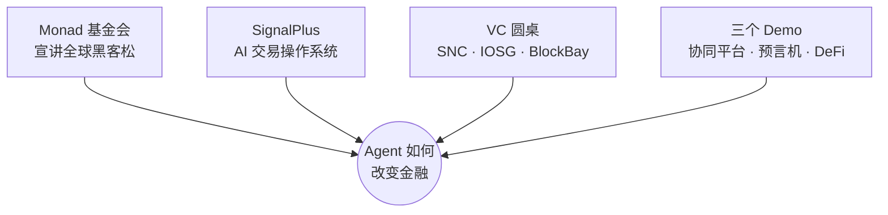

# Monad 黑客松宣讲与 Agent 金融圆桌 · 精读

> 来源：《Monai 黑客松宣讲与 Agent 金融应用探讨》现场录音（约 179 分钟，39 页转写稿）
> 活动结构：黑客松宣讲 → SignalPlus 主题分享 → VC 圆桌 → 三个项目 Demo → 自由交流。

## 这场活动讲了什么（全局地图）

**先纠正一个贯穿全文的转写问题**：录音里的「Monet / Mona / Monai / Monad foundation」指的都是 **Monad**——一条 2025 年主网上线的高性能 EVM 公链，是这场活动的主办方。下文统一写作 Monad。

---

# 第一部分：Monad 全球黑客松宣讲

## 1.1 为什么值得参加（开场）

**主讲人：Harry（Monad 生态）**

- 这届黑客松对标 **a16z Crypto Startup School** 这类顶级项目，是一个**全球性比赛**，不是城市小活动；
- 全球各地的投资人、行业导师（Mentor）都会关注，进入决赛名单（Final List）的项目会直接出现在他们眼前；
- 不止投资人，还有行业里有影响力的 Mentor，可能主动联系 Builder；
- 主讲人一句话号召：**「有好想法就申请，现在还来得及，截止日期 10 月 13 日。」**

**主讲人：Box（Monad Foundation 开发者关系 DevRel）**

- 提醒：线下参加活动 ≠ 已报名线上黑客松，需要自己去官网注册、提交项目；
- 报名后一定要用好「向导师提问」的功能，导师包括国外国内的 VC、创始人、成功项目方。

## 1.2 Monad 是什么（技术小白版）

> Monad 是一条**完全兼容 EVM 字节码的高性能公链**。

先解释 **EVM【概念】**：以太坊虚拟机，可以理解为「以太坊和很多区块链共用的一套操作系统 / 运行环境」。**兼容 EVM** 意味着：以太坊上的应用（智能合约）几乎不用改就能搬到 Monad 上跑，开发者也不用重新学一套。

Monad 主打的性能数字：

| 指标 | Monad | 大白话 |
|---|---|---|
| TPS | 约 10,000 | 每秒能处理约 1 万笔交易（以太坊约十几笔） |
| 出块时间 | 300 毫秒 | 约 0.3 秒产生一个区块 |
| 最终性 | 600 毫秒 | 约 0.6 秒后交易彻底确认、不可回滚 |
| 兼容性 | 100% 字节码 + RPC 兼容 | 以太坊合约、钱包、工具基本直接可用 |

**团队与资金背景**：

- 创始团队多来自顶尖量化交易机构（提到 Jane Street、Jump Trading 等），不是「草台班子」；
- 主网上线前已获得 **2 亿美元以上融资**，资金足以支撑多年运营；
- 主网后 TVL（链上锁仓资金总量）约 **10.3 亿美元**，较上线第一周增长约 7 倍；
- DeFi 元老级项目已部署，黑客松产出的社区项目也会被推向用户。

## 1.3 Monad 为什么快：四个技术创新

> 这部分偏硬核，**入门阶段看懂类比即可，不需要掌握实现**。但这是理解「新公链在卷什么」的关键。

### 创新 1：流水线化共识（像 CPU 流水线）

传统区块链里，「提议区块 → 投票 → 最终确认」是**一件做完再做下一件（串行）**。Monad 把它们拆开，像工厂流水线 / CPU 流水线一样并行：

- 提议第 2 个区块时，同时给第 1 个区块投票；
- 提议第 3 个区块时，同时确认第 1 个区块。

让每个时间片都被充分利用。

### 创新 2：共识与执行分离

- **共识（Consensus）**只决定「交易的先后顺序」；
- **执行（Execution）**才真正算出「每笔交易的结果」。

传统链这两件事挤在一个区块时间里串行做（以太坊要在 12 秒里同时干两件事）。Monad 把它们分开：执行区块 N 的时候，节点已经在对区块 N+1 达成共识，每个区块都能拿满 300 毫秒。

### 创新 3：乐观并行执行（并行执行、串行提交）

- 传统方式：交易一笔笔依次执行；
- Monad：**先假设交易之间没有冲突，全部同时（并行）执行**；
- 之后再按顺序「提交」，如果发现两笔交易争抢同一份数据（冲突，比如同时转账造成数据矛盾），就把冲突的交易**重新执行一遍**。

用「乐观」换取大部分交易的并行提速，只对少数冲突付代价。

### 创新 4：全新数据库架构（性能提升最大的一项）

以太坊用两层数据结构存数据（MPT 树 + LevelDB），在主讲人看来这种复杂结构极大拖慢了速度。Monad **合二为一**，重新设计数据库：

- 直接利用固态硬盘（SSD）原生的并行访问能力；
- 不再用二叉树方式间接存储，数据是什么样就直接写到硬盘；
- 这是 Monad 速度快的**最主要原因**。

### Monad 是「EVM 超级集」（额外增强）

- 更大的合约代码 / 初始化代码上限；单个区块有 **8GB 内存空间**，能跑很复杂的计算；
- 原生支持 **Passkey 签名**（可用苹果 ID / 生物识别给钱包签名，配套 SDK）；
- **存储费用改革**：连续排列的数据存在同一个硬盘「页」上，访问其中一个、同页其他数据自动变「热」，热数据读取只要 100 gas；以太坊每个数据槽都要 8100 gas。这让大规模链上存储（游戏、大数据库）成本大降；
- **内存计费改为线性**（以太坊偏二次方增长），复杂计算不再贵得离谱；
- **MEV 保护**：MEV【概念】指「靠交易排序 / 抢先交易获利」（比如「夹子」「抢跑」）。Monad 用加密内存池（每个验证者私有内存池，没有全局公开内存池）、交易在打包前不可见等机制，逐步杜绝抢跑攻击。

## 1.4 黑客松参赛规则（重点）

### 基本信息

- Monad 迄今最大的**线上**黑客松，持续约 6 周；
- 截止时间原定 **10 月 13 日**（可能延长，以官网为准），11 月 3 日公布奖项；
- 前期已在 34 个城市办 50 多场线下活动、2500+ 人到场；
- **总奖金 25 万美元**。

### 四大赛道（Track）

1. **链上金融与交易**（DeFi / Trading）；
2. **消费级产品**（Consumer，普通人用的应用）；
3. **社交 / 注意力 / 文化**（Social）；
4. **可信身份与 AI / 技术架构**（Identity & AI）。

官网每个赛道都有推荐 Idea 和评审关注点；不知道做什么可以直接去看推荐方向。

### 评分五维度（务必对照准备）

| 维度 | 评委看什么 | 给我们的启示 |
|---|---|---|
| 1. 创始团队与**市场就绪度** | 最重要的是 Market Readiness：有没有明确用户 / 社区，最好已上线、有真实用户反馈，而不是凭空想象 | 做项目先想清楚「谁会用」，先做用户调研 |
| 2. 技术实现 | 核心逻辑必须真的上线，**不接受纯 PPT**；AI 产品的核心逻辑必须跑在 Monad 链上；要用到 Monad 的性能特性 | 拒绝「能部署在任何链上」的平庸项目，要为 Monad 定制 |
| 3. 设计与工艺 | 产品流程完善，用户不需要懂一堆专业知识就能用，无缝上手 | 重视 UX，别让用户「学习怎么用」 |
| 4. 进展与下一步 | 看重黑客松**期间的实际更新量**，要在官网 Update 框持续更新：做了什么、和哪些用户交流 | 不能拿旧项目躺赢，过程要可见 |
| 5. 原创性与洞察 | 不能把已有项目改名换链；要讲清「你和现有方案（如某类 DeFi）的区别、核心判断」 | 要有自己对赛道问题的观点 |

### 奖金结构

- 四个赛道各 3 万美元奖池；额外 3 万美元「大赢家」Grand Prize（一个项目独享，且仍可参与赛道竞争）；
- 各赛道获奖者约 1 万美元；
- 另有大量 **Bounty（赞助商赏金）**：不在赛道内，需要在官网手动「添加」到参赛列表；
  - 每个 Bounty 有自己的要求（例如「产品必须用某大模型构建」「必须用 Alchemy 的 API」）；
  - 部分 Bounty 和赛道冲突，但大部分可叠加，「甚至可以全部加满」。

### 导师资源

- 包括知名 VC（提到 a16z、Coinbase Ventures 等）的创始人 / 投资人；
- 在官网 Mentor 板块可直接提问，是平时很难获得的交流机会。

---

# 第二部分：SignalPlus —— AI 时代的交易「操作系统」

**主讲人：Augustine（SignalPlus CEO / Partner，英文分享）**

## 2.1 公司背景

- SignalPlus 2021 年底成立，做**机构级交易系统**：定价引擎、自动化交易、交易终端——基本是对冲基金内部用来交易的全套软件；
- **不管理资产、不碰资产、不托管**，只做软件；
- 建在各大交易所「之上」（通过 API 接入），不是交易所的竞争对手；
- 客户包括 Binance、OKX 等交易所，以及 Cumberland、Paxos、Galaxy 等大机构；
- 月交易量曾超 200 亿美元，约 3 年时间拿下近 30% 市场份额；
- 团队是高盛 20 年交易员、前 Google / 阿里等；投资方含 HashKey 等。

## 2.2 发展三阶段（客户需求的演变）

1. **初期**：期权交易没有趁手工具，交易员自建系统，结果大家都想用 → 干脆转型做系统；当时链上（去中心化）条件不成熟，先聚焦中心化；
2. **中期**：机构资金入场，要求特定功能、合规适配，逐渐变成 SaaS 模式；
3. **2025 年（AI 时代）**：客户要求**开源 / 重组（Remix）终端产品，让 AI Agent 在上面搭建自己的交易系统**。

## 2.3 为什么交易系统这么「烂」

- 好交易员靠交易 / 管钱就能赚很多，**没动力去做开发**；
- 自建交易系统需要一整队人：交易员、量化（Quant）、开发者、建模师、风控、运营、会计，极难凑齐协作；
- 所以好系统都在对冲基金内部、不开放；银行里大量交易基础设施还停留在 70-90 年代，无法支持 7×24 连续交易。

## 2.4 AI 擅长什么、不擅长什么（核心干货）

### AI 擅长：研究流程

> 想法（Idea）→ 回测（Backtest）→ 部署（Deploy）→ 监控（Monitor）→ 复盘

这一整段研究过程 AI 做得非常好，可以当你最好的分析师。

### AI 不擅长（机构真正在意的三件事）

1. **机构知识（Institutional Knowledge）**：
   - 你知道 Binance 的服务器在东京、新加坡还是美国吗？每个接口的速率限制（Rate Limit）是多少？止损单有什么特殊规则？
   - 这些「踩坑踩出来的知识」AI 不知道，直接跑真实系统会出错、被封、甚至亏钱；
   - 每个交易所（纳斯达克、纽交所、Binance、OKX）都有自己的「脾气」，必须事先告诉 AI。
2. **无穷无尽的边缘情况（Edge Cases）**：
   - 系统宕机、突发新闻、执行到一半市场变动、AI 下单下不来说时订单已变市价单……
   - 交易是**真金白银、结果不可撤销**的，和写文章、写代码完全不同。
3. **合规审计（Compliance）**：
   - 监管要求准确记录：在什么时间、什么价格、什么地点交易；
   - 不能事后问 Claude / GPT——它们会「幻觉（Hallucinate）」、编造记录，监管不接受；
   - 必须在交易时就标准化记录（链上、链下都要），形成规范报告。

## 2.5 SignalPlus 的方案：AI 交易「操作系统 / 护栏（Harness）」

把它想象成一个**套在各种 AI 模型外面的「操作系统」**：

- 底层你仍可用 Claude、Codex 等任何模型；
- 系统提供所有「护栏」：参数、报表、风控、标准化网关；
- 每位用户获得一台**个人保护服务器**（AWS / 阿里云均可），交易系统跑在上面；
- 在保护服务器内用 AI Agent 搭建任意交易规则，并可发布到 **Marketplace（应用市场）** 分享，可开源可闭源，类似门槛更低的 App Store。

**关键保护机制：**

- **凭证隔离**：密钥 / 登录凭证像手机 Face ID 一样存在操作系统层，**Agent 永远看不到**，杜绝泄露；
- **策略密钥轮换**：不用改全部代码，中央层面更新、轮换策略密钥，方便多团队开发；
- **托管位置推荐（Colocation）**：根据策略推荐服务器位置（做这类交易该放新加坡 / 纽约 / 芝加哥），降低延迟；也可自己部署；
- **风险隔离**：出事时损失被限制在保护服务器内，不会一锅端；
- **全市场接入**：中心化交易所、DEX、传统券商（富途、老虎）、Hyperliquid，同一台保护服务器统一接入；宏观数据（美联储、IPO、SEC 文件）一站提供；
- **黑匣子（Black Box）**：像飞机黑匣子一样，实时记录 AI 决策逻辑，事后可取证「AI 当时为什么这么做」，而非事后编造。

**演示亮点**：

- 命令行里一句话描述需求（如期权 Wheel 策略），Agent 自动写代码、做界面；
- 经过人工 + AI 双重安全检查，可设置收费方式（免费 / 一次性），发布到商店；
- 产品是 PWA（网页应用），手机、电脑体验一致；
- 团队用「Vibe Coding」（用自然语言指挥 AI 写代码）三周做出：投资级期权定价网站（银行级定价模型、精度到 12 位小数）、仓位热力图、经济数据与回测。
- 现有交易终端对用户**免费**（向交易所收费）：signalplus.com；新操作系统约一个月后公测。

## 2.6 小白能学到什么

1. **「AI 很强大但不能裸奔」**：真实金融场景需要给 AI 套上护栏——凭证隔离、边缘情况处理、合规留痕、风险隔离。这是「AI 落地」和「AI Demo」的差距。
2. **幻觉（Hallucination）**：AI 会一本正经地编造内容。**凡是涉及事实、合规、记录，必须有可验证来源，不能听 AI 一面之词**。
3. **Colocation（服务器托管位置）、Rate Limit（速率限制）** 这类「机构知识」是行业壁垒，也是新人要靠实践积累的东西。
4. **Vibe Coding 是真实的生产力革命**：但要知道，AI 写的代码仍需人来审查安全性和正确性。
5. SignalPlus 是一个值得注册体验、长期跟踪的产品（免费）。

---

# 第三部分：VC 圆桌 —— Agent 如何改变金融

**嘉宾：**

- **Henry**：SNC 合伙人 / CBO。开发者社区与研究驱动，起源于 2014-15 年支持以太坊，十余年投资孵化 200-300 家企业，关注区块链基础设施、金融科技、代币化、稳定币支付；在香港有生态加速器；
- **Frank**：IOSG Ventures，2017 年成立的加密 VC，投了 150+ 项目，覆盖基础设施、L1/L2、DeFi、消费级，现在重点看金融科技、支付、AI；
- **Jack**：BlockBay（音）负责人，**X402 生态**最大的服务商（Facilitator）之一，做 Agent 支付基础设施，亚洲首批接入 **Visa VIC（Visa Intelligence Commerce）**，曾与百度、Visa 联合推出 Agent Spend，生态累计超 200 万笔交易。

> **X402【概念】**：基于 HTTP「402 Payment Required」状态码的支付协议，让 AI / 程序能用稳定币等为 API、服务自动付费，是 Agent 支付领域的热门基础协议。

## 3.1 议题一：Agent 怎样改变金融服务的提供方式

- **Henry**：Agent 已从简单任务试点，进入**核心决策环节**。但支付 / 交易只是最终「执行」，执行之前的中后台基础设施（风控、可信数据验证）才是最重要、最有价值的部分（SNC 也因此投资了 SignalPlus）。
- **Frank**：Agent 大幅提升执行效率，尤其**被动指数产品**。信息流高度透明后，个人可以管理自己的「盘（Book）」，比如自动复制知名 KOL / 政客（提到「佩洛西持仓」）做成「个人指数」，这对传统 ETF 提供商冲击很大。但**中低频可行，高频仍做不到**。
- **Jack（实践视角）**：
  - 平台已有 14 万+ Agent 注册；探索过 Agent 工作市场（完成任务赚奖励）、买机票、买演唱会门票（5 月与大麦跑通闭环）；
  - 但**交易量最大的，还是 Agent 自动买 Token、付 API 费**——因为这个场景买卖双方「缝隙（Gap）最小」、天然有 API、最容易建立信任；
  - 早期商家服务是「给人看的」，Agent 读不懂（半年前 Agent 的 GUI 操作能力还很弱）；
  - Agent 会自动比价、买到最便宜的 Token 并直接付费（与百度智能云合作，可自动调用百度模型）；
  - **Visa 合作**：由 Visa 提供法律与结算支撑，形式是「Agent Card（虚拟卡）」，把你的 Visa 信用卡映射给 Agent 用；
  - 早期谈 Agent 支付只想到稳定币，但对圈外人门槛高；**接入法币体系是 Agent 支付走向主流的关键**；
  - 与百度合作的机制：Agent 发现额度 / Token 不够时，自动优化链路、推荐购买合适的 Token（如 DeepSeek），百度提供模型与建议、BlockBay 走支付、Visa 负责结算，形成闭环。

## 3.2 议题二：Agent 催生哪些新需求 / 新机会

- **Henry**：
  - C 端在中国很卷（价格、时效敏感）；**机构端（B 端）价值链机会更大**；
  - 香港银行体系仍传统（很多业务要跑柜台，虽有 8 家虚拟银行），跨境贸易场景效率低；
  - 提到 **Stripe 2025 年推出 Agent 卡**（底层是一家创新银行），正进入亚洲服务 B 端；
  - 核心逻辑：金融和 Web3 一样，**中间商太多**，要用智能合约 / Agent 自动撮合，减少人为干预。
- **Frank**：
  - **AI Agent 的网页访问量已超过人类**（引用数据：约 51% 互联网流量由 AI 驱动），个人 Agent（提到 Manus 等）会绕过「广告」这套传统互联网商业模式；
  - 新趋势：网站不再允许免费爬取，而是通过**微支付（按请求 / 按 API / 按时段付费）来捕获 Agent 流量的价值**，「Agent Commerce」会爆发；
  - 国内看好**跨境电商 + 稳定币（提升资金效率）+ AI（视频、Demo、客服）**的组合。
- **Jack**：
  - 团队多出自蚂蚁，懂电商支付与风控；**Agent 支付与传统电商不同**：电商是「给钱交货」一次性完成，Agent 是「意图（Intention）驱动」，由一长串步骤构成（调生图 API、买 Token、做搜索……），链路很长，需要中间件；
  - 商户端还没准备好接入 Agent，需要和 Visa 这类金融机构合作，帮商户无摩擦接入；
  - 大额场景（炒股、量化）需要时间积累信任，框架要符合用户预期。

## 3.3 议题三：哪些环节形成长期壁垒，哪些会被「商品化」

- **Henry**：
  - 最核心的是**「与钱相关的决策环节」**（银行风控 / 经理审批后放款；企业的资金、采购部门）；
  - 他称之为 **「Agent Mandate Manager（代理人托管经理）」**；
  - 引用数据：自 2024 年 9 月以来，Agent 支付累计约 **5500 万美元、约 100 万个钱包地址、几百万笔交易**，仍处非常早期的测试阶段；
  - 当风控、数据验证、纠错等基建成熟，Agent 可代表企业采购、代表投资人部署资金、代表银行授信放款，且 7×24 工作，释放巨大价值。
- **Frank**：
  - **支付通道本身容易商品化**（大家都能接）；
  - 壁垒在**路由层（Routing）**：根据价格、延迟、地区，智能选择走哪条支付通道；
  - 应用层需要 **「审查者 / 评估者（Reviewer / Evaluator）」**：判断 Agent 的产出对不对，不同行业有不同基准（Benchmark）。
- **Jack**：
  - 产品里有 **Mandate（授权约束）** 功能：创建一笔预算（如 100 美元），设定规则（单笔不超过 10 美元等），Agent 在约束内自由支付；
  - Agent 支付的特点是**小额高频**（可小到 0.000x 美元），传统支付交易成本太高（东南亚等地一笔成本可能 0.1 美元以上），这正是 Agent + 区块链的价值；
  - **最有价值的数据是「交易前的授权与风控逻辑」以及「结算数据」**，这是大模型替代不了的，企业已开始有意识收集，未来价值很大。
- **Henry 补充**：自己同时用 4-5 个模型（订阅 + 绑卡），痛点是额度不足时反复刷卡、企业资金成本不可控——更说明需要统一管控。

## 3.4 嘉宾在用的产品（可体验）

- **Jack**：推荐个人 Agent 产品 Manus、Muse（音）；
- **Frank**：认可「给每个 Agent 配一台电脑」的产品（关机也能跑任务、Agent 之间能交接工作、与 1Password 合作管密钥、可通过命令行接入其他模型）；
- **Henry**：各家都试过；他们用 AI 做**投研初筛**（VC 每天看大量项目，希望把时间留给创始人），并想要一个围绕创始人 / 生态会员的数据库（公开 + 私下信息结合）。

## 3.5 议题四：2-3 年后 Agent 普及的影响与个人应对

- **Henry**：
  - AI 让 Web3「无需许可空间」里过去无法落地的好想法变得可行，**Agent 是缺失的那块拼图（Missing Piece）**；
  - 金融服务业的人分两类：**有判断力（Judgment）和人脉（Network）的人——AI 取代不了；执行层——会被 Agent 取代**。人应转向决策和社交层。
- **Frank**：
  - 加密圈和 AI 圈人才正在合流（不少 AI 产品创始人是加密背景）；
  - AI 降低了学习高难度概念的门槛、扩大了认知广度；小团队能用 AI 让产出「复利式」增长。
- **Jack**：
  - AI 提高了效率，但**工作时间反而更长**（不裁人，而是默认一个人能干更多事、探索更多）；
  - Agent 支付仍早期，需要商户共同加入，**AI 时代「人与人的信任与协作」反而更重要**。

## 3.6 现场问答精选

- **问（大陆支付限制）**：能用这些平台绕开限制、方便订阅海外 API 吗？
  - **Jack**：要分清问题本质——是「没有加密货币」还是「订阅被扣」；虚拟卡公司在做但容易被风控；这类问题更多是公司 / 发卡政策，与 Agent 支付协议本身关系不大。
- **X402 生态**：从协议层往上，企业和开发者共同推动，但可信验证、风控、确权等基建仍需补齐；
  - 提到 Stripe 在推动一个开放的法币 / 稳定币互通标准（音似 Open USD），拉 Visa、Mastercard、银行参与，目标是开源、无需许可的支付应用；
  - 判断：应用层和基建层「双向奔赴」，但**尚未规模化**；少数公司在特定领域跑通闭环，关键看能否做大。

---

# 第四部分：三个 Demo 项目

## 4.1 项目一：多人 × 多 Agent 协同平台

**主讲人：增长负责人；技术负责人答问。团队 15-16 人，核心出自腾讯文档、字节剪映 / 即梦。**

### 痛点

用 Claude Code / Codex 做出东西后，要下载、整理到 Notion / Google Docs / 飞书，再开会汇报；同事还得再下载、让自己的 Agent 读一遍——**上下文在不同人的 Agent 之间反复搬运，摩擦极高**。

### 为什么是现在

Agent 已从「对话」走到「执行（写代码、做视频、买东西）」、再走进「工作环境」；Claude Code、Codex 都在做 Agent 团队、共享上下文，成为竞争焦点；虚拟机环境管理技术成熟。

### 产品

- 创建一个「**房间**」：能看到所有通话历史、每个 Agent 的实时运行状态（第一秒的过程都可见）、Agent 的产出；
- 把房间链接甩给同事，**直接接着改，不用搭环境、不用重新理解上下文**；
- 同事能在房间里用你的 Claude Code / Codex，但**不需要你分享账号密码**（共享 Agent 额度）；
- 支持群聊、分享 / 撤销 Agent 权限、分享文件、@ 任意对话历史或产出（Markdown、图片）。

### 技术与竞品

- 个人 IP 登录信息存本地；每个 Agent 配一台虚拟机；只有工作过程和产出共享，且在授权范围内可见；
- 竞品多在「消息层面」共享，该项目主打「**运行时状态共享**」（深度最深），冲突实时解决、可持久协作；
- 月底支持上传整个文件夹、共享本地工作区。

### 技术问答（有营养）

- **多人上下文怎么管、不被污染？** 分成「对话 Session」和「产出（代码文件）」：文件在同一工作区天然共享；思考过程通过「鉴权式查询接口」检索（提供 Session 索引，以文本存储让 Agent 检索）；
- Agent 引擎跑在用户自己电脑上（账号不上云），虚拟化框架只把文件读写、指令同步到房间；思考过程会脱敏后上云，方便别人检索、接管；
- 「Pudding Mode」：把任务拆分，简单任务派给便宜模型（DeepSeek、Flash），尚在内测；
- 隐私：10 月将支持「个人资产维度权限」（房间里也有只有自己 Agent 能读的东西）、私有化部署；不触碰模型与 Agent 本身。

## 4.2 项目二：去中心化预言机 Logo + Irrational Market

**主讲人：项目方。**

> **预言机（Oracle）【概念】**：把链外的真实世界数据（最典型是价格）送到链上的桥梁。DeFi 没有价格数据就无法运行。

### Logo：完全去中心化预言机

**痛点（对比 Chainlink）**：

- Chainlink 由全球约 25 家确定的公司报价，主体不常更换 → **单点风险**；
- 价格**延迟严重**（举例：英伟达价格波动超 5% 才往链上传），期权 / 永续合约对价格极敏感，延迟会带来对手方风险；
- **准入门槛高**：你懂港股想报价，但没有公开机制，只能设法挤进那 25 家小圈子；
- 它只是「把价格传上去」，没有证明这个价格是博弈出来的公允价。

**机制（用市场博弈定价）**：

- **报价者（Price Provider）**：报出价格并**抵押资产**。例：认为某资产值 100 美元，就抵押 2 个该资产 + 200 美元稳定币；报价正确获奖励，恶意报价（想操纵）被罚没；
- **验证期（Verification Phase）**；
- **监督者 / 套利者（Watcher）**：监控链上价格，价格合理就不动；不合理就「抗议 / 套利」，把正确价格搬上链：
  - 报价**过低**（如市场实际 120，你报 100）：套利者付给你 200 美元、取走你抵押的 2 个资产，立刻去市场按 120 卖出获利；
  - 报价**过高**同理，机制对称；
  - 若报价者诚实，则毫无损失。
- 必须跑在**快速出块的链**上（确认十几秒尚可，20 秒以上机制就失去意义）。

### Irrational Market：允许「做空一切」的市场

**核心观点**：

- **任何有价值的资产都应该能做空**；
- 一个只能做多的市场，等于**惩罚理性**：理性的人觉得价格过高或过低，但只能做多就只能赌「过低」；
- 只能做多会鼓励非理性追高（引用华尔街名言：市场不理性时，你要想清楚「你是想证明自己对，还是想赚钱」）；
- 做空机制给理性人「用行动纠偏」的工具。

**举例**：港股某公司（音）因股票代码缩写是「LLM」，在 AI 热潮中开盘疯涨，尽管业绩很差；而港股通常要交易满一年、流动性足够才有期货、期权，初期只能做多 → 难以公允价格发现。

**产品**：基于其预言机，任何由价格驱动的资产都能做多 / 做空。Demo 中测试资产为某股票和港币：认为高估就转入资产做空，价格下跌即盈利。未来还需期权 / 做市商支撑。

**问答**：

- 与 Chainlink 区别：去中心化、任何人可报价（自担风险）、价格发现更快；
- 做空如何实现：参照传统期权市场（卖 Call / Put、风险中性做市商）；可在港股券商开户，按需对冲并加收溢价；
- A 股：散户只能用股指期货做空，个股无做空；方案是智能合约 + 做市商当对手方（赚价差），并强调合规；
- 产品是智能合约，希望机构主动接入，坦言「走向市场（GTM）很难」。

## 4.3 项目三：Yield Max —— 稳定币 DeFi 的「选池 + 撤退」服务

**主讲人：三峰。国内某头部中老年交友平台负责人，因定投 BTC/BNB/ETH 约 5 年入圈。**

### 起因与定位

- 2024 年 10 月一些 DeFi 池子爆雷，主讲人亏了钱，意识到：**DeFi 不是「投进去就结束」，风险一直在变，需要持续跟踪**；
- Yield Max 把「**选时、看时、撤退**」做成持续服务：专业筛选池子、专业跟踪、风险响应；目标是让复杂的 DeFi 决策变简单。

### 选池「灵魂四问」

1. 这个池子的**收益从哪来**？
2. **什么情况会导致亏损**？
3. **谁能改变规则**？是不可篡改的智能合约，还是有中心化控制方？
4. 池子要爆雷时，**怎么撤退**？

### 产品设计

- 至少三档：低 / 中 / 高风险池，收益不同；
- 核心能力是**快速撤退**，抢在爆雷前帮用户退出；
- 充分提示风险：不保证及时兑付、「待回收」与可用资金分开、申请退出 ≠ 立刻到账、底层流动性不足时会等待；
- 用户只需四步：选风险档 → 投 USDC → 看持仓 → 退出；
- **不碰用户资金**（链上公开可见），不宣称「没有竞争对手」（技术上谁都能做），聚焦 USDC、公开选池理由；
- 真正的护城河：**历次爆雷的响应记录和实际退出结果**；
- 观点：Web2 项目已不适合「长期主义」，Web3 反而更适合；金融型项目不赶时间上线，要先充分验证。
- 此行目的：找有 DeFi 经验的从业者、找 USDC 用户做访谈（而非拉投资）。

---

# 第五部分：自由交流 —— 一位前辈给入门学习者的建议

> 转写末尾，一位已工作的前辈（信息系统 / 数据分析背景）和一位同样在入门阶段的
> 学习者（数据 × 金融交叉方向，处境很有参考性）的对话，含金量很高。

**前辈的建议整理：**

1. **硬技能 AI 越来越能代劳，关键是「深耕一个行业」**：金融、医疗健康是最稳的两大方向（人离不开），制造业、零售也可以；
2. **出海 / 引进海外项目，本质是抓「信息差」**——这正是外语 + 技术复合人才的机会；
3. **不要焦虑**：焦虑没用，唯一能做的是「向 AI 靠近，不要反感它」，学会与 AI 协作；
4. **金融行业「难进但难出」**：建立在人脉和信任基础上，进去了就比较稳；
5. **做自己能控制的事**：AI 怎么发展别想太多；
6. **找金融专业的同学组队**：他们懂行业知识，你懂技术 / 工具，互相借力；
7. **实习要扩大范围海投**，传统行业（金融）的实习也别拒绝，去了说不定喜欢；
8. **先想清楚兴趣**：传统金融偏「硬知识」，有人觉得乏味；要多尝试，因为职业是几十年的事，**做自己感兴趣的才能长久**；
9. 互联网大厂（阿里、腾讯）已过最黄金阶段、很卷；
10. **普通人还是要工作，边工作边投资**；投资需要本金和时间积累，没有一夜暴富。

---

# 全篇总结：这场活动给我的 10 个关键认知

1. **Monad = 兼容以太坊（EVM）的高性能新公链**，靠流水线共识、共识执行分离、乐观并行、新数据库四大创新提速；
2. 黑客松是小白进入行业**性价比最高的路径**：奖金、导师、曝光、人脉一站获得，但**必须真做出能跑的东西**；
3. 评分最看重「市场就绪度」——**先有真实用户和反馈，再谈技术**；
4. **AI Agent 的终点是「替人执行」，执行绕不开支付**；Agent 支付是确定性的新赛道；
5. Agent 支付正从「稳定币」走向「法币（Visa / Stripe 虚拟卡）」，**降低门槛才能主流化**；
6. **X402 + MCP** 是 Agent 调用服务、自动付费的两块重要拼图；
7. AI 在金融里不能「裸奔」：需要凭证隔离、风控、合规留痕、风险隔离、黑匣子；
8. 价值集中在**决策 / 授权（Mandate）、路由、评估（Evaluator）、风控数据**，单纯的支付通道会商品化；
9. 行业缺的不只是工程师，还有**运营、内容、社区、产品、合规**——非技术背景有大量切入点；
10. 对个人：**深耕行业 + 拥抱 AI + 公开输出 + 长期主义 + 不碰看不懂的钱**。

# 我现在能做什么（入门版清单）

- [ ] 去 Monad 黑客松官网「逛一圈」：看赛道、推荐 Idea、评分标准、Bounty，**即使这届来不及，也先看懂规则**；
- [ ] 报名账号、加入官方 Discord / 社群，先当观察者，目标是**下一届正式参赛**；
- [ ] 注册体验 SignalPlus（免费）和嘉宾提到的 Manus 等产品，建立「产品体感」；
- [ ] 搞懂这几个词：**EVM、TPS、最终性、MEV、预言机、X402、稳定币、智能合约**；
- [ ] 用「选池四问」的思维，去分析一个你听过的 DeFi / 理财项目（**只分析，不投钱**）；
- [ ] 开始物色 1-2 名「懂金融 / 懂编程」的同学，为未来组队做准备；
- [ ] 阅读 [学习路线图](../roadmap/learning-path.md)，把这些认知落到长期学习计划里。

> 返回 [会议精读目录](./index.md) ｜ 下一步 → [小白概念词典](../fundamentals/core-concepts.md)
