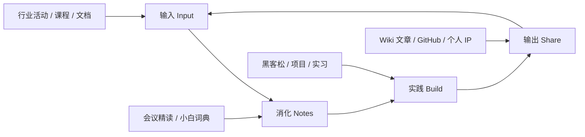

# 欢迎来到我的 Web3 学习 Wiki

一个广外大一学生的 AI × Web3 公开学习档案：**本科四年 → 港 / 新 Web3 硕士 → 进入行业**。

---

## 快速开始

如果你是第一次来，建议按这个顺序阅读：

1. [**从这里开始**](./00-start-here/index.md)：了解这份 Wiki 的理念和学习心法；
2. [**小白概念词典**](./02-glossary/01-beginner-dictionary.md)：先把最基础的 20 个概念搞懂；
3. [**四年总路线图**](./03-roadmap/01-four-year-roadmap.md)：看清全局，知道大一现在该做什么；
4. 然后挑一篇 [**会议精读**](./01-meeting-notes/01-pitch-night.md)，看看真实行业里的人在做什么；
5. 想动手时，翻 [**行动手册**](./05-playbooks/01-hackathon-guide.md)。

## 这份 Wiki 里有什么

学习就是一个「**输入 → 消化 → 实践 → 输出**」的循环，这份 Wiki 同时是我的笔记本、作品集和简历。

## 一句话信念

> 焦虑没用，唯一能做的是向它靠近；不碰看不懂的钱，靠时间和作品说话。

## 目录总览

| 板块 | 说明 |
|---|---|
| [会议精读](./01-meeting-notes/01-pitch-night.md) | 把真实行业活动嚼碎了讲给小白听 |
| [小白词典](./02-glossary/01-beginner-dictionary.md) | 术语大白话解释 + 黑话对照表 |
| [四年路线图](./03-roadmap/01-four-year-roadmap.md) | 分学年行动计划 + 港新硕士清单 |
| [技能与资源](./04-skills/01-skill-tree-resources.md) | 技能树、免费课程、英语标化 |
| [行动手册](./05-playbooks/01-hackathon-guide.md) | 黑客松、GitHub、实习求职 |
