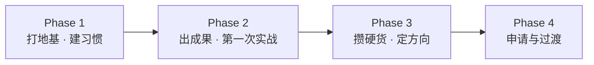

# 学习路线图

> A long-term learning roadmap toward advanced study and a career in global
> Web3 ecosystems — built one phase at a time.

## 全局一张图

每个阶段都围绕「学业基础 / 语言 / 技术 / 实践与输出」四条线推进，后一阶段建立在
前一阶段之上，但允许根据实际情况反复迭代。

## 筛选与录取看什么（先理解规则）

以授课型研究生项目的常见权重粗略排序：

1. **学术背景与 GPA**（门槛项，高 GPA 是最直接的竞争力）；
2. **语言成绩**（雅思 / 托福，硬门槛）；
3. **相关软背景**：实习、项目、竞赛（黑客松）、科研、交换；
4. **文书 + 推荐信 + 面试**：讲一个「为什么、凭什么读这个方向」的可信故事；
5. **GRE / GMAT**：部分项目建议或要求（例如有的项目参考 GRE 320 / GMAT 700）。

> 现实策略：**用高 GPA + 有竞争力的语言成绩 + 多段相关实践 + 公开作品集，去建立
> 整体可信度**。本路线图的安排都围绕这个公式。

---

## Phase 1 · 打地基 + 建习惯

> 关键词：**学业基础、语言启蒙、概念入门、知识库上线、进入社群**

### 学业（最高优先级）

- [ ] 从每一门课开始稳住 GPA，尽量争取高排名；
- [ ] 重点学好：微积分 / 高数、线性代数、概率论、英语，以及任何编程 / 计算机导论课；
- [ ] 主动认识任课老师，为日后科研与推荐信打基础。

### 语言

- [ ] 把英语融入日常：每天读英文 Web3 / AI 资讯（见 [资源](./skills-resources.md)）；
- [ ] 了解目标标化（雅思 / 托福）题型，积累词汇、练听力口语；
- [ ] 本阶段后期可做一次模考摸底，先暴露问题。

### 技术启蒙（不追求快，先不害怕）

- [ ] 搞懂基础：命令行、Git / GitHub、Markdown（跟着 [GitHub 与本站搭建](../handbook/github-site.md)）；
- [ ] 入门一门语言，建议从 **Python** 开始，完成基础语法；
- [ ] 建立 Web3 体感：安装钱包、领取测试币、在测试网完成一笔转账（**不花真钱**）；
- [ ] 体验 MCP、Agent 付费相关 Demo，理解 Agent 如何调用工具 / 完成支付。

### 实践与输出

- [ ] **把这个知识库推上 GitHub**，持续更新；
- [ ] 每参加一场活动 / 读懂一个主题，写一篇公开笔记；
- [ ] 加入几个高质量社群（项目 Discord、开发者社区），先观察、适时提问；
- [ ] 关注黑客松信息，来不及参赛就先看懂规则；
- [ ] 留意交换 / 暑校 / 联合培养等机会。

### 阶段假期

- [ ] 系统学 JavaScript 基础；
- [ ] 做一个最小项目（例如用 Python 调公开 API 做小工具）；
- [ ] 参加线上 / 线下活动，开始认识同行。

---

## Phase 2 · 出成果 + 第一次实战

> 关键词：**语言出分、智能合约入门、第一次黑客松、第一段实习**

### 学业与语言

- [ ] 保持 GPA 稳定；
- [ ] **语言正式出分**，达到目标项目要求并留出重考空间；
- [ ] 若成绩不理想，尽早二战，不要往后拖。

### 技术

- [ ] JavaScript / TypeScript + Node.js 基础；
- [ ] **入门 Solidity 与智能合约**（交互式教程、官方文档、Cyfrin Updraft）；
- [ ] 学会 Hardhat 或 Foundry，在测试网部署第一个合约；
- [ ] 理解 DeFi 核心：代币、DEX、借贷、稳定币、预言机（结合 [核心概念词典](../fundamentals/core-concepts.md)）。

### 实践（里程碑）

- [ ] **组队参加一次黑客松**，目标是完整提交、不强求获奖（见 [黑客松指南](../handbook/hackathon.md)）；
- [ ] 做 1-2 个能写进简历的 GitHub 项目（前端 + 合约的完整小应用）；
- [ ] **争取第一段相关实习**：可从运营、内容、社区、增长、DevRel 助理切入（见 [实习指南](../handbook/internship.md)），远程也可；
- [ ] 争取一次暑校 / 交换（拿推荐信、体验目标地区）。

### 输出

- [ ] 知识库增加「实战复盘」：黑客松、项目、实习复盘；
- [ ] 开始经营公开账号（如 X），持续发布学习与项目内容。

---

## Phase 3 · 攒硬货 + 定方向

> 关键词：**高质量实习、黑客松获奖、科研、推荐信、标化**

### 学业与标化

- [ ] 稳住 GPA（后期成绩在申请时仍是重要参考）；
- [ ] 视目标项目准备 **GRE / GMAT**，集中攻克；
- [ ] 语言成绩若将过期，安排重考。

### 技术进阶

- [ ] Solidity 进阶与安全：测试、模糊测试、常见漏洞、审计基础；
- [ ] 完整全栈能力：React / Next.js + 合约 + 索引（如 The Graph）；
- [ ] 选一个细分方向深入：**Agent 支付 / DeFi / DID / RWA / ZK**，形成自己的判断。

### 实践（含金量最高的阶段）

- [ ] **多段高质量实习**（优先目标地区、知名项目、有留用或强推荐信）；
- [ ] 再参加多次黑客松，争取进入决赛 / 获奖；
- [ ] 参与开源，给真实项目提交 PR；
- [ ] **科研产出**：跟随导师做区块链 / AI 金融相关课题，争取工作坊 / 论文成果；
- [ ] 锁定 2-3 位推荐人（课程教授 + 科研导师 + 实习负责人）。

### 输出

- [ ] 公开作品集成型：稳定的博客 / 知识库 + 公开账号 + 可展示项目；
- [ ] 确保个人网站（GitHub Pages）可访问、内容最新。

---

## Phase 4 · 申请与过渡

> 关键词：**文书、网申、面试、毕业设计、Offer**

### 申请节奏（提前准备、卡准节点）

- [ ] 申请季前：最终确定目标项目（冲刺 / 主申 / 保底分层）、考齐标化、敲定推荐人；
- [ ] 准备 PS / CV、推荐信与作品集；
- [ ] 注意不同地区节奏差异：部分地区为**滚动录取（Rolling），越早递交越有利**；
  部分项目**仅一轮、有固定截止日**，务必提前查官网；
- [ ] 递交后跟进、准备面试（模拟面试 + 英文表达）；
- [ ] 收到 Offer 后比较、确认、办理签证与住宿。

### 学业收尾

- [ ] 毕业设计尽量结合 Web3 / AI（可延续自己的项目）；
- [ ] 保持最后阶段成绩，避免条件录取翻车。

---

## 通用节奏（建议收藏）

| 周期 | 固定动作 |
|---|---|
| 每天 | 英文资讯 + 代码 / 工具练习 |
| 每周 | 1 篇学习笔记或项目进度（提交到知识库） |
| 每月 | 复盘目标进度，更新路线图 |
| 每个学期 | 1 个可展示成果（项目 / 比赛 / 实习 / 科研） |
| 每个假期 | 实习 / 暑校 / 高强度项目（假期是拉开差距的关键） |

## 风险与备选

- **若 GPA 不占优**：优先选择更看重综合材料的项目，延长实践积累；用一段高质量实习过渡也是可选项；
- **若技术学得吃力**：可走非技术赛道（运营 / 市场 / 合规 / 投研 / DevRel），同样能入行，且能发挥语言优势；
- **行业周期风险**：牛熊波动大，「修铁路」型能力（工程、合规、金融）跨周期更稳；
- **政策风险**：关注主要目标市场的监管动向，优先选择合规生态。

## 下一步

- 看 [海外深造参考](./graduate-study.md)，建立具体目标；
- 按 [技能树与资源](./skills-resources.md) 开始系统学习；
- 动手 [把知识库推上 GitHub](../handbook/github-site.md)。
