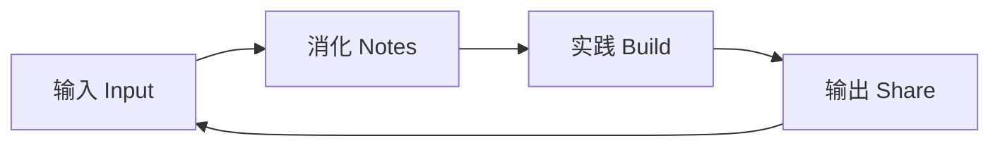

# How to Use This Wiki

## The loop

整个知识库围绕一个循环组织：

- **Input**：行业活动、官方文档、课程、协议源码；
- **Notes**：用自己的话重写，标注术语与来源；
- **Build**：做项目、跑测试网、参加黑客松；
- **Share**：发布笔记、开源代码、与人交流，再获得新输入。

## Where to go, depending on your goal

| 你想做什么 | 去哪里 |
|---|---|
| 建立基础概念 | [核心概念词典](../fundamentals/core-concepts.md) |
| 查一个术语 / 谐音黑话 | [黑话对照表](../fundamentals/glossary.md) |
| 看真实行业里的人在做什么 | [Field Notes](../field-notes/pitch-night.md) |
| 规划长期学习 | [学习路线图](../roadmap/learning-path.md) |
| 找课程与工具 | [技能树与资源](../roadmap/skills-resources.md) |
| 准备黑客松 | [黑客松指南](../handbook/hackathon.md) |
| 搭建自己的知识库 | [GitHub 与本站搭建](../handbook/github-site.md) |
| 找实习 / 了解岗位 | [实习与求职指南](../handbook/internship.md) |

## Suggested reading order

1. 读完 Start 两页，理解方法与定位；
2. 过一遍 [核心概念词典](../fundamentals/core-concepts.md)，不要求记住，建立直觉；
3. 挑一篇 [Field Notes](../field-notes/pitch-night.md)，看概念如何落在真实项目上；
4. 跟着 [学习路线图](../roadmap/learning-path.md) 开始动手，做第一个小东西。

## How to contribute

这是一个开源学习项目，欢迎：

- 指出事实性错误、过时信息或失效链接；
- 补充更准确的解释、来源或翻译；
- 在 GitHub 提 Issue 或 Pull Request（详见仓库 README 的 Contributing）。

## A note on accuracy

内容为个人学习记录，可能包含理解偏差或语音转写误差：

- 能核实的名词给出标准写法（例如转写中的「Monet / Mona」应为 **Monad**）；
- 不确定的内容明确标注「待核实」；
- 外部事实尽量附来源链接；项目数据、招生与申请要求等**请以官方最新页面为准**。

> 返回 [Introduction](./index.md)
